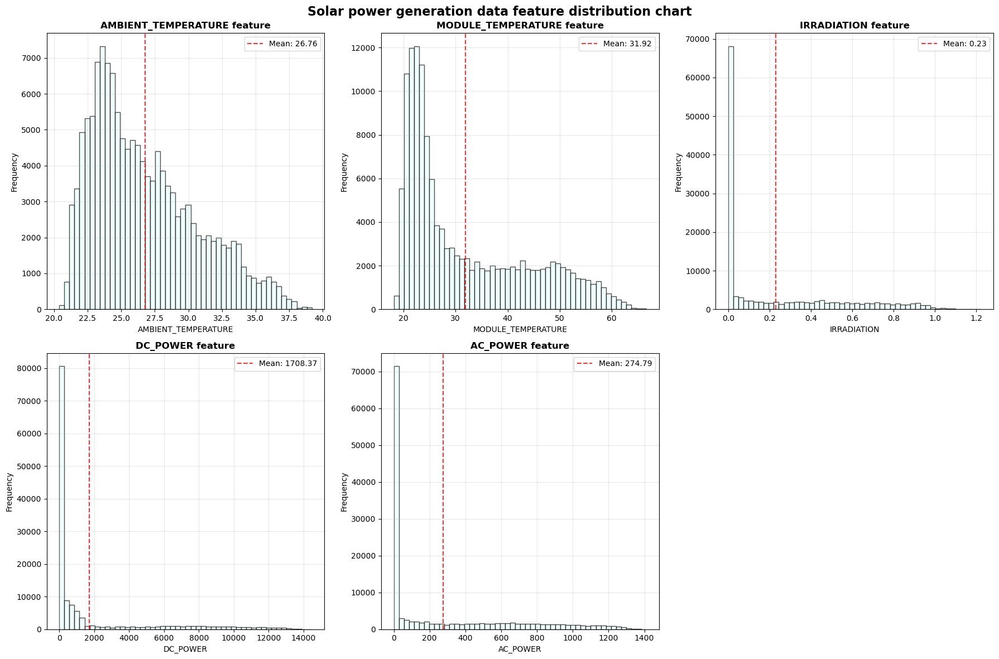
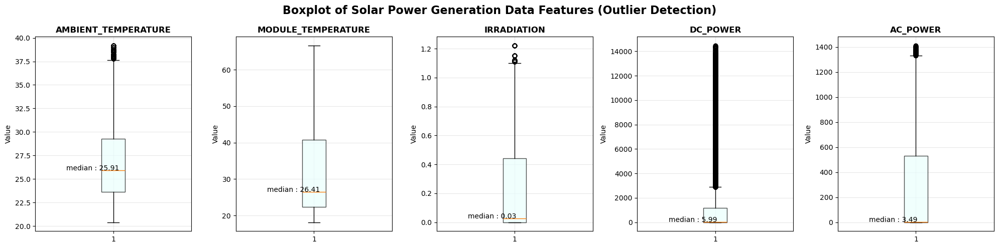
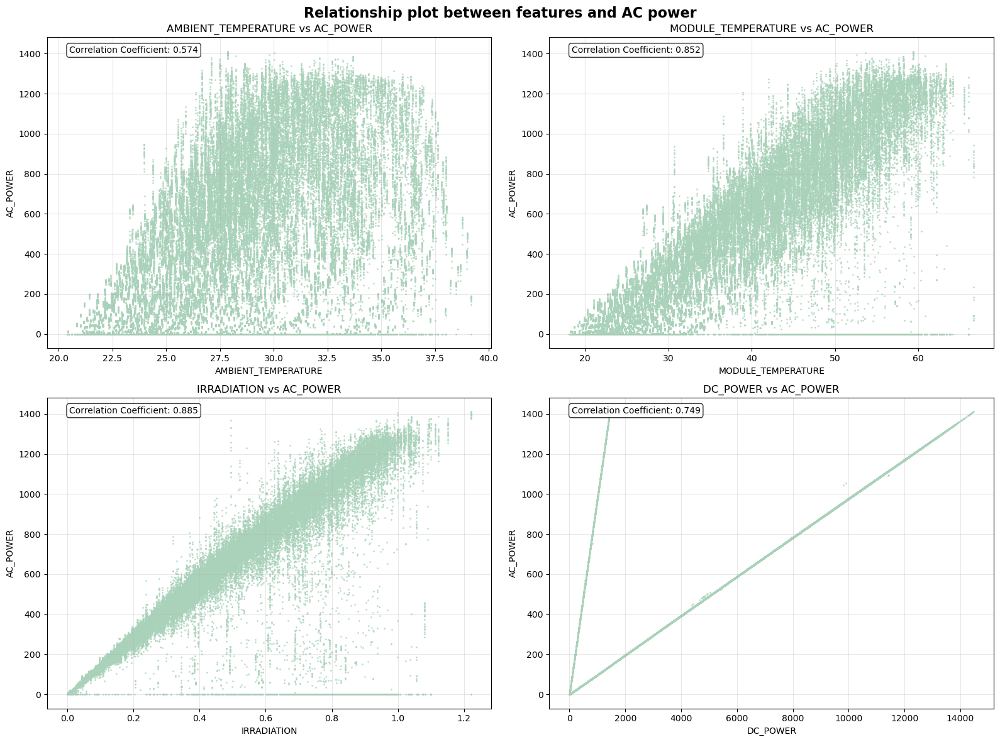

# SolarVision: 3D Solar Energy Forecasting & Interactive Dashboard
*Accurate short-term solar irradiance predictions with AI, coupled with immersive 3D visualizations and a dynamic web dashboard for actionable insights.*

## Project Story
The rise of renewable energy has reshaped the way we think about electricity generation, with solar power taking center stage. As more solar panels are installed across cities and rural areas, the sheer volume of data they generate offers a unique opportunity: to **turn raw environmental measurements into actionable insights**.  

SolarVision was born from the vision of combining **cutting-edge AI** with **immersive 3D visualizations**, transforming complex solar data into an interactive experience. By blending deep learning predictions with intuitive dashboards and stunning Blender-rendered visuals, the project aims to **empower energy planners, engineers, and enthusiasts** to explore solar trends, anticipate fluctuations, and make informed decisions.  

This is more than just a forecasting tool—it's a bridge between data, technology, and actionable energy solutions.

## The Problem
Unreliable solar energy forecasting can lead to:
- Grid instability  
- Inefficient energy storage  
- Financial losses for solar farms  

SolarVision addresses this by predicting solar output with high accuracy while offering an interactive 3D visualization to understand solar patterns intuitively.

---
## How the system works
### 1. Dataset :
 **Source:** 

 

 Solar Power Generation Data. This data has been gathered at two solar power plants in India over 34 days. It has two pairs of files - each pair has one power generation dataset and one sensor readings dataset. The power generation datasets are gathered at the inverter level - each inverter has multiple lines of solar panels attached to it. The sensor data is gathered at a plant level, with a single array of sensors optimally placed at the plant.
  Dataset link : [Solar Power Generation Data](https://www.kaggle.com/datasets/anikannal/solar-power-generation-data/data).
  
**Features:** 

 - *AMBIENT_TEMPERATURE*:  is the temperature of the surrounding environment where a person, object, or process exists. 
 - *MODULE_TEMPERATURE*: There's a module (solar panel) attached to the sensor panel. This is the temperature reading for that module.
 - *IRRADIATION*: Amount of irradiation for the 15-minute interval.
 - *DC_POWER*: Amount of DC power generated by the inverter (source_key) in this 15 minute interval. Units - kW.

**Target:**
 -  *AC_POWER*: Amount of AC power generated by the inverter (source_key) in this 15 minute interval. Units - kW.
   
**Preprocessing:**

After checking the missing values in the four datasets **Plant_1_Generation_Data**, **Plant_1_Weather_Sensor_Data**,  **Plant_2_Generation_Data**, **Plant_2_Weather_Sensor_Data** , merging  **Plant_1_Generation_Data** with **Plant_1_Weather_Sensor_Data** and merging  **Plant_2_Generation_Data**, **Plant_2_Weather_Sensor_Data** , merge the two merged data 1 and 2 by columns date and Plant_ID, we have the total merged data, after this step we created the model data which holds the features columns; the set of feature and the target variable.

  

**Exploratory Data Analysis (EDA):**
- **Distribution of Features:**
  
  

  

   Ambient temperature is mostly moderate (22–28°C) with a right-skew (mean ~26.7°C) and no extreme outliers. Module temperature is also right-skewed (20–30°C most common; up to 60°C; mean ~31.9°C) and tends to exceed ambient, warranting correlation with power output. Irradiation shows a strong spike at 0 with most values 0.1–1.0 and a mean ~0.23, explaining frequent near-zero power; DC power has a large 0 spike (night/clouds, mean ~1708) requiring filtering, and AC power mirrors this pattern with a 0 spike and a mean ~275 due to conversion losses and night values.

  

Ambient temperature: Median ~25.9°C (≈ histogram mean 26.7°C); most values lie between ~23–28°C with rare hot outliers above ~37°C, indicating a stable distribution with few very hot days.
Module temperature: Median ~26.4°C; wider spread than ambient (~22–40°C) and outliers above ~65°C; panels typically operate around 25–40°C, but extreme heating occurs under high irradiance.
Irradiation & Power: Irradiation median ~0.03 (mostly night/low sun); data mostly low values, with rare high irradiance. DC power median ~6 W (night values dominate the median) with a long tail to >14,000 W; AC power median ~3.5 W, heavily skewed with outliers up to 1400 W, reflecting conversion losses and prominent zero-night values.

  

The four scatter plots show how AC power relates to ambient temperature, module temperature, irradiance, and DC power, with a Pearson correlation coefficient displayed on each subplot.
Strong positive relationships are seen for irradiance (~0.885) and module temperature (~0.852), a substantial but weaker link for DC power (~0.749), and a moderate link for ambient temperature (~0.574).
Correlation indicates linear associations (not causation); consider adding regression lines and R² to quantify explained variance and check for nonlinear patterns.
